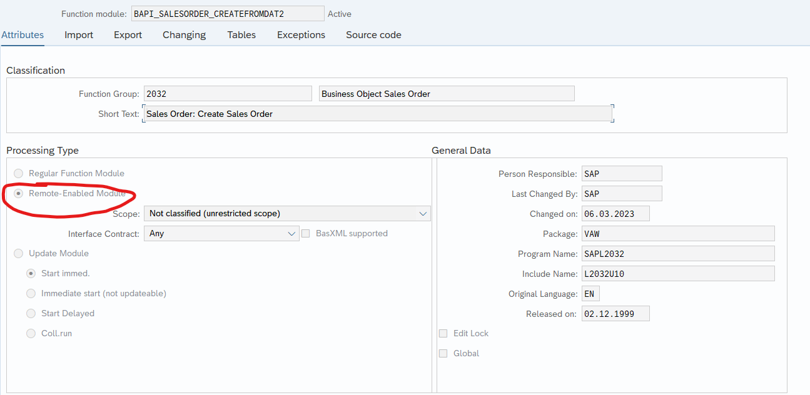
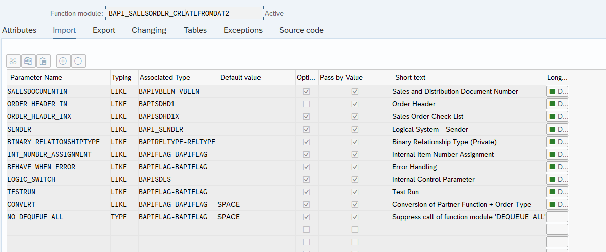
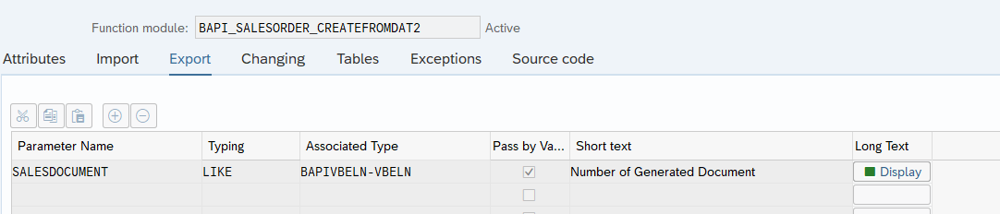

# BAPI

Une BAPI (Business Application Programming Interface) est une interface standardisée de SAP permettant d'accéder aux fonctionnalités des modules SAP via des programmes externes.

## Objectif : Utiliser la BAPI => "BAPI_SALESORDER_CREATEFROMDAT2"

### Documentation officielle :

```text
Functionality
You can use this method to create sales orders.

You must enter at least sales order header data (via ORDER_HEADER_IN structure) and partner data (via the ORDER_PARTNERS table) as input parameters.

Enter the item data via the ORDER_ITEMS_IN table. You can allocate item numbers manually, by filling in the relevant fields, or the system does it, according to the settings for Customizing, by leaving the relevant fields blank.

If you have configurable items, you must enter the configuration data in the ORDER_CFGS_REF, ORDER_CFGS_INST, ORDER_CFGS_PART_OF and ORDER_CFGS_VALUE tables.

Credit cards can be transferred via the BAPICCARD structure, on the one hand, data for card identification, on the other, data for a transaction which has taken place in an external system.

Once you have created the sales order successfully, you will receive the document number (SALESDOCUMENT field). Any errors that may occur will be announced via the RETURN parameter.

If no sales area has been created in the sales order header, then the system creates the sales area from the sold-to party or ship-to party, who has been entered in the partner table. If a clear sales area cannot be created, you will receive a system message, and the sales order will not be created.

PayPal Transactions

Two-step transactions with PayPal can also be transferred via BAPICARD structure. The two-step transaction with PayPal is similar to the payment with credit card. Therefore, the following settings are also used for payments with PayPal: Card category 01 for credit cards and payment plan type 03 for processing payment cards.

The following applies for payments with PayPal:

Use card type DP2P (field CC_TYPE)
Use service provider DPPP (field DP_PSP)
Transfer the complete authorization data
The following checks are made for PayPal transactions:

If card type equals DP2P (one-step transaction DP1P is currently not supported)
If no token is provided for DP2P cards
If an authorization ID is available
If only one PayPal payment is assigned
Concerning the "Limit to" functionality:
If the value to be billed (field BILLAMOUNT) is not transferred, the value is automatically set to the authorized amount (field AUTHAMOUNT).
If the value to be billed is transferred, it must be equal to the authorized amount; otherwise an error message occurs.
Notes
Mandatory entries:
ORDER_HEADER_IN : DOC_TYPE Sales document type
SALES_ORG Sales organization
DISTR_CHAN Distribution channel
DIVISION Division

ORDER_PARTNERS..: PARTN_ROLE Partner role, SP sold-to party
PARTN_NUMB Customer number

ORDER_ITEMS_IN..: MATERIAL Material number

Ship-to party:

If no ship-to party is entered, use the following: Ship-to party =
sold-to party.
Commit control:
The BAPI does not have a database commit. This means that the relevant application must leave the commit, in order that can be carried out on on the database. The BAPI BAPI_TRANSACTION_COMMIT is available for this.
German key words:
The following key words must be entered in German, independantly of
the logon language:
DOC_TYPE Sales document type, for example: TA for standard order
PARTN_ROLE Partner role, for example: WE for ship-to party
Further Information
You can find further information in the OSS. The note 93091 contains general information on the BAPIs in SD.
```

### Résumé des points importants de la BAPI "BAPI_SALESORDER_CREATEFROMDAT2"

- **Fonction principale** : Créer des commandes clients dans SAP.
- **Paramètres obligatoires** :
  - **ORDER_HEADER_IN** : DOC_TYPE (type de document de vente), SALES_ORG (organisation commerciale), DISTR_CHAN (canal de distribution), DIVISION (division).
  - **ORDER_PARTNERS** : PARTN_ROLE (rôle partenaire, SP pour le client principal), PARTN_NUMB (numéro de client).
  - **ORDER_ITEMS_IN** : MATERIAL (numéro de matériau).
- **Attribution des numéros d'articles** : Manuelle ou automatique (selon la personnalisation).
- **Gestion des articles configurables** : Utilisation des tables ORDER_CFGS_REF, ORDER_CFGS_INST, ORDER_CFGS_PART_OF, et ORDER_CFGS_VALUE.
- **Transactions avec carte de crédit et PayPal** :
  - Gestion des cartes via la structure BAPICCARD.
  - Transactions PayPal gérées comme les paiements par carte de crédit (type de carte DP2P, fournisseur de services DPPP).
- **Numéro de document** : Renvoi du numéro de document de vente (SALESDOCUMENT) en cas de succès.
- **Erreur** : Les erreurs sont renvoyées via le paramètre RETURN.
- **Zone de vente** : Si elle n'est pas définie, elle est déterminée automatiquement à partir des données du partenaire (client principal ou de livraison).
- **Commit de base de données** : Nécessite un appel explicite à la BAPI BAPI_TRANSACTION_COMMIT pour valider les modifications dans la base de données.


## Fonction module 'BAPI_SALESORDER_CREATEFROMDAT2'

-> SE37 = 'BAPI_SALESORDER_CREATEFROMDAT2'

```ABAP
function bapi_salesorder_createfromdat2.
*"----------------------------------------------------------------------
*"*"Local Interface:
*"  IMPORTING
*"     VALUE(SALESDOCUMENTIN) LIKE  BAPIVBELN-VBELN OPTIONAL
*"     VALUE(ORDER_HEADER_IN) LIKE  BAPISDHD1 STRUCTURE  BAPISDHD1
*"     VALUE(ORDER_HEADER_INX) LIKE  BAPISDHD1X STRUCTURE  BAPISDHD1X
*"       OPTIONAL
*"     VALUE(SENDER) LIKE  BAPI_SENDER STRUCTURE  BAPI_SENDER OPTIONAL
*"     VALUE(BINARY_RELATIONSHIPTYPE) LIKE  BAPIRELTYPE-RELTYPE
*"       OPTIONAL
*"     VALUE(INT_NUMBER_ASSIGNMENT) LIKE  BAPIFLAG-BAPIFLAG OPTIONAL
*"     VALUE(BEHAVE_WHEN_ERROR) LIKE  BAPIFLAG-BAPIFLAG OPTIONAL
*"     VALUE(LOGIC_SWITCH) LIKE  BAPISDLS STRUCTURE  BAPISDLS OPTIONAL
*"     VALUE(TESTRUN) LIKE  BAPIFLAG-BAPIFLAG OPTIONAL
*"     VALUE(CONVERT) LIKE  BAPIFLAG-BAPIFLAG DEFAULT SPACE
*"     VALUE(NO_DEQUEUE_ALL) TYPE  BAPIFLAG-BAPIFLAG DEFAULT SPACE
*"  EXPORTING
*"     VALUE(SALESDOCUMENT) LIKE  BAPIVBELN-VBELN
*"  TABLES
*"      RETURN STRUCTURE  BAPIRET2 OPTIONAL
*"      ORDER_ITEMS_IN STRUCTURE  BAPISDITM OPTIONAL
*"      ORDER_ITEMS_INX STRUCTURE  BAPISDITMX OPTIONAL
*"      ORDER_PARTNERS STRUCTURE  BAPIPARNR
*"      ORDER_SCHEDULES_IN STRUCTURE  BAPISCHDL OPTIONAL
*"      ORDER_SCHEDULES_INX STRUCTURE  BAPISCHDLX OPTIONAL
*"      ORDER_CONDITIONS_IN STRUCTURE  BAPICOND OPTIONAL
*"      ORDER_CONDITIONS_INX STRUCTURE  BAPICONDX OPTIONAL
*"      ORDER_CFGS_REF STRUCTURE  BAPICUCFG OPTIONAL
*"      ORDER_CFGS_INST STRUCTURE  BAPICUINS OPTIONAL
*"      ORDER_CFGS_PART_OF STRUCTURE  BAPICUPRT OPTIONAL
*"      ORDER_CFGS_VALUE STRUCTURE  BAPICUVAL OPTIONAL
*"      ORDER_CFGS_BLOB STRUCTURE  BAPICUBLB OPTIONAL
*"      ORDER_CFGS_VK STRUCTURE  BAPICUVK OPTIONAL
*"      ORDER_CFGS_REFINST STRUCTURE  BAPICUREF OPTIONAL
*"      ORDER_CCARD STRUCTURE  BAPICCARD OPTIONAL
*"      ORDER_TEXT STRUCTURE  BAPISDTEXT OPTIONAL
*"      ORDER_KEYS STRUCTURE  BAPISDKEY OPTIONAL
*"      EXTENSIONIN STRUCTURE  BAPIPAREX OPTIONAL
*"      PARTNERADDRESSES STRUCTURE  BAPIADDR1 OPTIONAL
*"      EXTENSIONEX STRUCTURE  BAPIPAREX OPTIONAL
*"----------------------------------------------------------------------
* generate data record
  fbgenmac 'BAPI_SALESORDER_CREATEFROMDAT2'.
* Core FLE MATNR BAPI Changes
  include flematnrin1.
* End Core FLE MATNR BAPI Changes

* Begin FLE Segmentation BAPI changes
  perform sfle_sgt_conversion
  tables
    order_items_in
    order_items_inx
   using ' '
   changing return.
* END FLE Segmentation BAPI changes
ENHANCEMENT-POINT bapi_salesorder_createfrom_g8 SPOTS es_sapl2032 STATIC.

ENHANCEMENT-POINT bapi_salesorder_createfrom_g6 SPOTS es_sapl2032.

* BAPIs run without dialog
  call function 'DIALOG_SET_NO_DIALOG'.

ENHANCEMENT-SECTION     bapi_salesorder_createfromd_02 SPOTS es_sapl2032.
"N_3223126 start of correction
" checking if customer is using NFM solution. If no, then core SD_SALESDOCUMENT_CREATE should be called

data: begin of g_mat_tbl1 occurs 10,
        nemat(1),
      end   of g_mat_tbl1.

select single nf_flag from mvke  into g_mat_tbl1-nemat.
if  g_mat_tbl1-nemat is not  initial.
  "{ Begin ENHO /NFM/SD_BAPI_SALESORDER_CREA_1 IS-MP-NF /NFM/SD }
* N 1523764 Refresh sv_bapi_data at start (FORM get_bapi_data)
  data: new_bapi_data  type boole_d.

  new_bapi_data = 'X'.
  export new_bapi_data to memory id '/nfm/new_bapi_data'.

* /NFM/ processing - C5007732
  call function '/NFM/CA_BAPI_TRANSFER_DOCITM'
    exporting
      im_doc_type_nfm = 'A'
      im_documentin   = salesdocumentin
      im_simulation   = testrun
    tables
      t_nfmetallitms  = nfmetallitms
      t_return        = return.
* check if error occurred
  loop at return transporting no fields
                    where type = 'E' or
                          type = 'A'.
    exit.
  endloop.
  if sy-subrc <> 0.
    "{ End ENHO /NFM/SD_BAPI_SALESORDER_CREA_1 IS-MP-NF /NFM/SD }
    call function 'SD_SALESDOCUMENT_CREATE'
      exporting
        salesdocument           = salesdocumentin
        sales_header_in         = order_header_in
        sales_header_inx        = order_header_inx
        sender                  = sender
        binary_relationshiptype = binary_relationshiptype
        int_number_assignment   = int_number_assignment
        behave_when_error       = behave_when_error
        logic_switch            = logic_switch
        business_object         = 'BUS2032'
        testrun                 = testrun
        convert_parvw_auart     = convert
        i_no_dequeue_all        = no_dequeue_all
      importing
        salesdocument_ex        = salesdocument
      tables
        return                  = return
        sales_items_in          = order_items_in
        sales_items_inx         = order_items_inx
        sales_partners          = order_partners
        sales_schedules_in      = order_schedules_in
        sales_schedules_inx     = order_schedules_inx
        sales_conditions_in     = order_conditions_in
        sales_conditions_inx    = order_conditions_inx
        sales_cfgs_ref          = order_cfgs_ref
        sales_cfgs_inst         = order_cfgs_inst
        sales_cfgs_part_of      = order_cfgs_part_of
        sales_cfgs_value        = order_cfgs_value
        sales_cfgs_blob         = order_cfgs_blob
        sales_cfgs_vk           = order_cfgs_vk
        sales_cfgs_refinst      = order_cfgs_refinst
        sales_ccard             = order_ccard
        sales_text              = order_text
        sales_keys              = order_keys
        extensionin             = extensionin
        partneraddresses        = partneraddresses
        extensionex             = extensionex.

    "{ Begin ENHO /NFM/SD_BAPI_SALESORDER_CREA_1 IS-MP-NF /NFM/SD }
* N 1523764 Refresh sv_bapi_data at start (FORM get_bapi_data)
* /NFM/ processing - C5007732
    call function '/NFM/CA_BAPI_DOCITM_GET'
      tables
        t_nfmetallitms = nfmetallitms.
  endif.                             "sy-subrc <> 0.
  "{ End ENHO /NFM/SD_BAPI_SALESORDER_CREA_1 IS-MP-NF /NFM/SD }
else.
  call function 'SD_SALESDOCUMENT_CREATE'
    exporting
      salesdocument           = salesdocumentin
      sales_header_in         = order_header_in
      sales_header_inx        = order_header_inx
      sender                  = sender
      binary_relationshiptype = binary_relationshiptype
      int_number_assignment   = int_number_assignment
      behave_when_error       = behave_when_error
      logic_switch            = logic_switch
      business_object         = 'BUS2032'
      testrun                 = testrun
      convert_parvw_auart     = convert
      i_no_dequeue_all        = no_dequeue_all
    importing
      salesdocument_ex        = salesdocument
    tables
      return                  = return
      sales_items_in          = order_items_in
      sales_items_inx         = order_items_inx
      sales_partners          = order_partners
      sales_schedules_in      = order_schedules_in
      sales_schedules_inx     = order_schedules_inx
      sales_conditions_in     = order_conditions_in
      sales_conditions_inx    = order_conditions_inx
      sales_cfgs_ref          = order_cfgs_ref
      sales_cfgs_inst         = order_cfgs_inst
      sales_cfgs_part_of      = order_cfgs_part_of
      sales_cfgs_value        = order_cfgs_value
      sales_cfgs_blob         = order_cfgs_blob
      sales_cfgs_vk           = order_cfgs_vk
      sales_cfgs_refinst      = order_cfgs_refinst
      sales_ccard             = order_ccard
      sales_text              = order_text
      sales_keys              = order_keys
      extensionin             = extensionin
      partneraddresses        = partneraddresses.
endif.
"N_3223126 end of correction
END-ENHANCEMENT-SECTION.

* reset the dialogflag
  call function 'DIALOG_SET_WITH_DIALOG'.


ENHANCEMENT-POINT bapi_salesorder_createfrom_g7 SPOTS es_sapl2032.
*FLE MATNR BAPI Changes
  include flematnrout1.
* End FLE MATNR BAPI Changes

* Begin FLE Segmentation BAPI changes
  perform sfle_sgt_conversion
  tables
    order_items_in
    order_items_inx
   using 'X'
   changing return.
* END FLE Segmentation BAPI changes

endfunction.
```

- Attributes: Processing Types = Remote-Enabled Module:
  
- Import: 
- Export: 